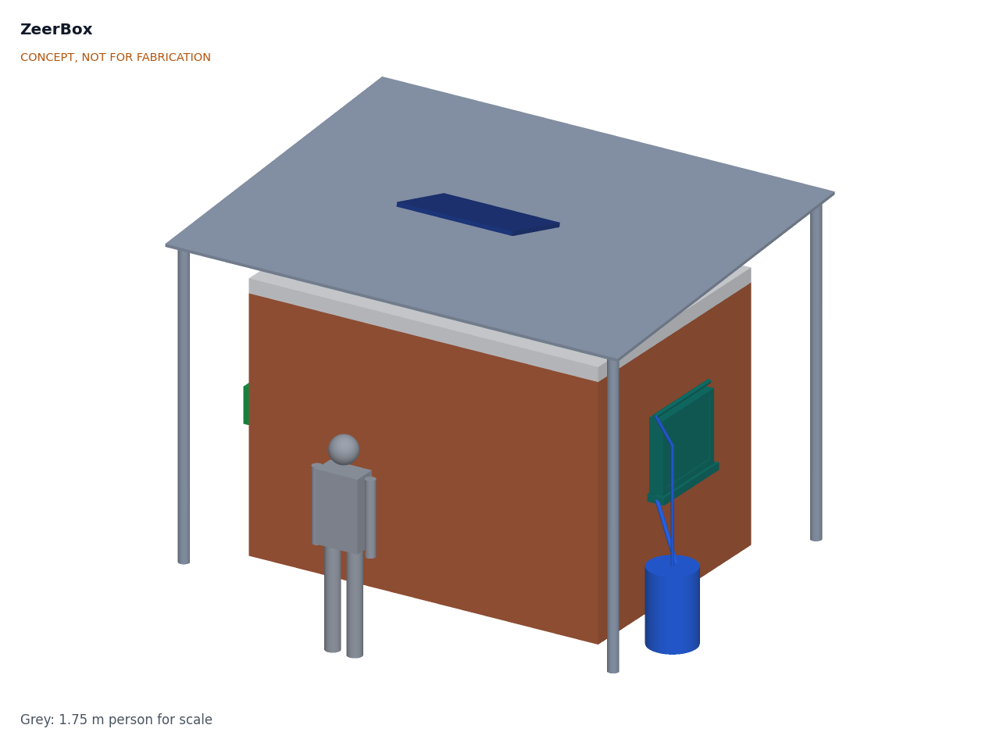

# ZeerBox

  

**Area:** Agriculture · **TRL:** 3 of 9 (proof of concept on paper) · **Prototype budget:** $300 USD for the cooling equipment kit · **Difficulty:** 2 of 5

Walk-in evaporative cooling chamber with a solar fan that forces air through a wetted pad, and a controller that responds to humidity.

[Interactive 3D model](media/viewer.html) · [Concept blueprint (PDF)](media/concept-blueprint.pdf) · [General arrangement ZBX-DWG-001 (PDF)](cad/drawings/ZBX-DWG-001.pdf) · [Sizing note ZBX-CAL-001](docs/04-calcs/01-sizing.md) · [Review note](docs/REVIEW.md)

## Concept rationale

Refrigeration is the right answer for a market hub with a business behind it, but it is the wrong starting point for a farm with no grid and no capital. Evaporative cooling needs only water, air and a little power, and in hot, dry weather it can hold produce several kelvin below the outside air (about 10 K on paper for ZeerBox). ZeerBox takes the principle of the clay zeer and the brick zero energy cool chamber and scales it to a room a person can walk into, with shelves at working height, a pad and two 12 V fans for a controlled airflow, and a controller that stops the store from making things worse when the air turns humid.

It is open and garage-buildable because the people who need it are far from any supplier of cold rooms. The structure is ordinary masonry, timber and corrugated sheet that a local mason and carpenter already know, and the cooling kit is a poultry-house pad, generic DC fans, a small pump and solar home system parts, all replaceable from a regional town. Publishing the geometry, calculations and bill of materials lets a partner adapt the size, wall material and crop mix to its own site.

## Burning platform

About 14 % of the food produced for human consumption is lost between harvest and retail, and a further 17 % is wasted. UNEP and FAO estimate that the lack of effective refrigeration alone caused the loss of 12 % of total food production in 2017, enough to feed around 1 billion people at a time when 811 million were hungry ([UNEP and FAO, *Sustainable Food Cold Chains*, 2022](https://www.unep.org/resources/report/sustainable-food-cold-chains-opportunities-challenges-and-way-forward)).

The losses fall hardest on perishables and on the farmers who grow them. Without a cool place to hold a harvest for a few days, a grower must sell on the day of picking at whatever price is offered. A solar walk-in cold room in the Malawi and Zimbabwe pilots cost about $40,000 per unit ([Efficiency for Access](https://efficiencyforaccess.org/wp-content/uploads/Lessons-learned-from-implementing-solar-powered-walk-in-cold-rooms-for-smallholder-agriculture-in-Zimbabwe-and-Malawi.pdf)), far beyond a smallholder or a small farmer group.

## Where it could be used

### By industry

| Industry | Use |
| --- | --- |
| Smallholder horticulture | Hold one to five days of tomatoes, peppers, okra and leafy greens so they can be sold when the price is right |
| Farmer groups and cooperatives | Shared store at a collection point, loaded by several members on a rota |
| Market trading | Keep stock fresh between market days at a stall or small depot |
| Agricultural extension and NGOs | Demonstration store and training unit for postharvest handling programs |
| School and community gardens | Short-term storage of garden produce for school meals or local sale |

### By country or region

| Country or region | Why it matters there |
| --- | --- |
| Mali and the wider Sahel | Long hot, dry seasons suit evaporative cooling; in field use in Mali, brick chambers cut the daily peak temperature by up to 10.4 °C when the air was below 40 % RH, but by only 4.2 °C above 70 % RH ([Verploegen, Sanogo and Chagomoka, MIT D-Lab](https://d-lab.mit.edu/sites/default/files/inline-files/GHTC%20-%20Evaluation%20of%20Low-Cost%20Evaporative%20Cooling%20Technologies%20for%20Improved%20Vegetable%20Storage%20in%20Mali.pdf); [MIT News, 2018](https://news.mit.edu/2018/mit-d-lab-cite-evaluation-low-cost-evaporative-cooling-devices-mali-0620)) |
| Northern Nigeria | Home of the modern zeer revival ([*TIME*, 2001](https://content.time.com/time/specials/packages/article/0,28804,1936165_1936254_1936632,00.html)); pay-per-crate solar walk-in cold rooms such as ColdHubs, at about $0.50 per crate per day, sit in markets, collection centers and farm clusters rather than on individual farms ([ColdHubs](https://coldhubs.com/); [IFPRI](https://www.ifpri.org/blog/coldhubs-addressing-crucial-problem-food-loss-nigeria-solar-powered-refrigeration/)) |
| India | The zero energy cool chamber was developed at the Indian Agricultural Research Institute; one study found tomato shelf life rising from 6 to 11 days ([*e-planet* 18(2)](https://www.e-planet.co.in/images/Publication/vol-18-2/storage.pdf)) |
| Kenya | MIT D-Lab has piloted forced-air evaporative chambers, some solar powered, the closest prior work to ZeerBox ([MIT D-Lab](https://d-lab.mit.edu/research/evaporative-cooling-vegetable-preservation)) |
| Malawi and Zimbabwe | Solar cold room pilots showed the demand and the cost, about $40,000 per unit, with some rooms largely unused ([Efficiency for Access](https://efficiencyforaccess.org/wp-content/uploads/Lessons-learned-from-implementing-solar-powered-walk-in-cold-rooms-for-smallholder-agriculture-in-Zimbabwe-and-Malawi.pdf)) |
| Australia (arid interior) | A high-income example with a long evaporative tradition: the Coolgardie safe, invented in the Western Australian goldfields in the late 1890s, kept food cool by trickling water through a hessian cover ([Western Australian Museum](https://visitwanderland.com.au/explore/golden-outback/warden-finnertys-residence/coolgardie-safe)) |

## What sparked the idea

The idea traces back to the pot-in-pot cooler, or zeer, that Mohammed Bah Abba popularized in Nigeria from 1995: a small earthenware pot inside a larger one, with moist sand between them, cooling the inner pot as the water evaporates ([MIT D-Lab, evaluation of evaporative cooling in Mali](https://d-lab.mit.edu/sites/default/files/inline-files/GHTC%20-%20Evaluation%20of%20Low-Cost%20Evaporative%20Cooling%20Technologies%20for%20Improved%20Vegetable%20Storage%20in%20Mali.pdf)). Bah Abba, a teacher from a potmaking family, received a Rolex Award for Enterprise for the work; *TIME* reported that eggplants kept for 27 days instead of three and that 12,000 coolers had been sold ([*TIME*, Best Inventions of 2001](https://content.time.com/time/specials/packages/article/0,28804,1936165_1936254_1936632,00.html)). The zeer shows how far evaporation can go with no power at all, and also where it stops: a pot holds a family's vegetables, not a farmer's harvest, and it cannot tell when the air is too humid to cool. ZeerBox keeps the principle and the name and asks what the same idea looks like at the scale of a walk-in room, with a fan, a deeper pad and a sensor to decide when to use them.

## Problem

Smallholders lose produce after harvest because they have no cold storage. Refrigerated cold rooms cost tens of thousands of dollars, and passive evaporative coolers are small and fail in humid weather. Design with, not for: requirements must come from co-design sessions and field trials with the intended users through a local partner.

## Concept

A walk-in store (2.4 x 1.5 x 2.0 m inside, 24 crates) with double brick walls around a dry rice husk cavity. Two 12 V fans pull outside air through a 150 mm wetted cellulose pad, and a controller reads temperature and humidity inside and out to choose between evaporative cooling, night ventilation and hold. A 150 W solar panel with a small battery powers it. The TRL 3 calculation puts the store at about 24.3 °C on a 35 °C, 30 % RH day, 10.7 K below the outside air, using about 36 L of water. Store humidity is about 81 %, just above the 80 % target and at risk in the unfavorable case (estimates, [ZBX-CAL-001](docs/04-calcs/01-sizing.md)).

Full design precis: [docs/02-concept.md](docs/02-concept.md)

## Key components

- Double brick walls with a dry rice husk cavity, insulated ceiling and shade roof
- 150 mm cellulose evaporative pad with drip header and gutter
- Two 250 mm 12 V DC exhaust fans
- 60 L sump drum with a 12 V pump
- 150 W PV panel, 20 A PWM charge controller and small LiFePO4 battery
- Controller with inside and outside humidity and temperature sensors

The priced bill of materials is in [bom/bom.csv](bom/bom.csv). The $300 budget covers the cooling equipment kit, about $270; the structure is built from local materials and costed separately, about $355 (indicative).

## Safety

> A walk-in room: the door must open from inside. Warm recirculating water can grow *Legionella*, so cover, drain and clean the sump weekly. Contains a LiFePO4 battery; use a BMS, fuse it and keep it shaded. Guard the fans. Not for meat, fish, milk or medicines.

## Repository layout

| Folder | Contents |
| --- | --- |
| `docs/` | Problem, concept, requirements, calculations and design decisions |
| `cad/src/` | build123d Python source, the source of truth for all geometry |
| `cad/step/`, `cad/stl/` | Exported models for FreeCAD, other CAD tools and printing |
| `cad/drawings/` | 2D sketches and dimensioned drawings |
| `bom/` | Bill of materials |
| `electronics/` | KiCad schematics and PCB layouts |
| `firmware/` | Microcontroller code |
| `media/` | Renders, perspectives and photos |
| `build-log/` | Dated prototyping notes |

## Documentation

Controlled documents follow the portfolio [documentation standard](.kit/STANDARDS.md). Each carries a document ID (ZBX-PRC-001 for the precis), a version and a revision history. Branded PDFs are built with `python .kit/render.py` and attached to GitHub Releases when a document is tagged, for example `ZBX-PRC-001/v1.0`.

## Credits

Designed by Amish Chadha. See [CONTRIBUTORS.md](CONTRIBUTORS.md) for roles. To cite this design, use [CITATION.cff](CITATION.cff) (GitHub shows it as "Cite this repository").

AI assistance (Claude) was used to accelerate concept renders, prototype documentation and first-pass sizing calculations. Design direction and all decisions are Amish Chadha's, recorded in this repository's decision records (`docs/decisions/`).

## Licenses

- **Hardware** (CAD, drawings, BOM, electronics): [CERN-OHL-S v2](LICENSE)
- **Software** (firmware, scripts, notebooks): [MIT](LICENSE-SOFTWARE)

A project of the [Design Molecule](https://designmolecule.com) lab.
