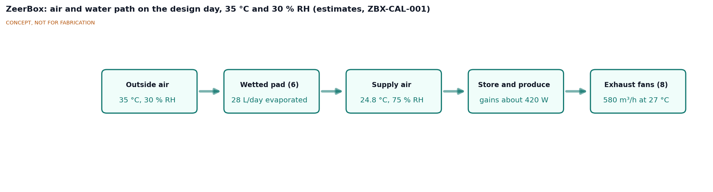
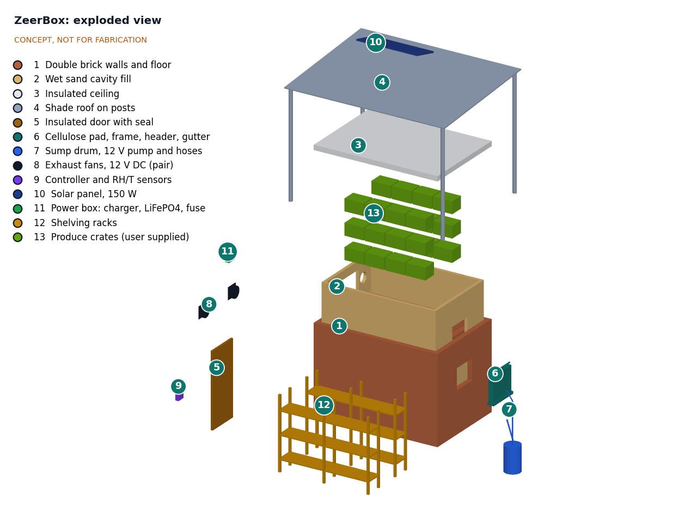
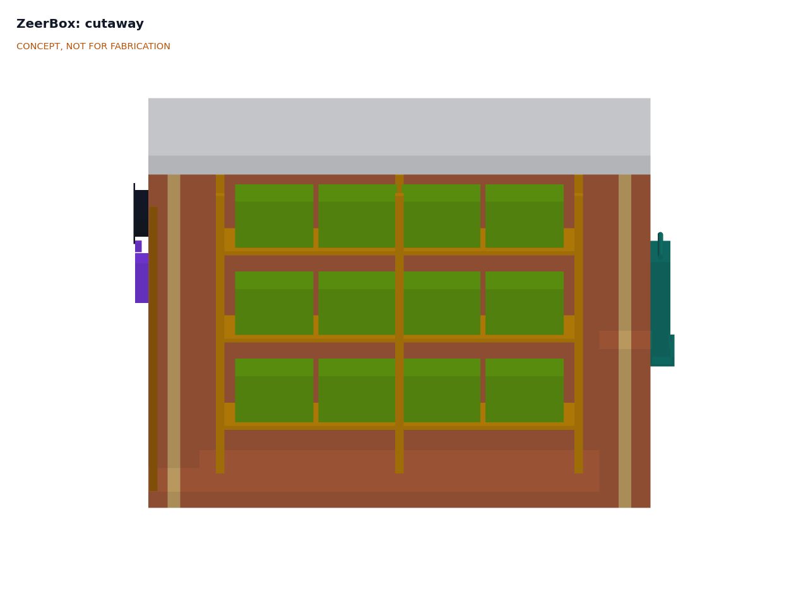

# ZeerBox design precis

ZeerBox is a walk-in store, 2.4 x 1.5 x 2.0 m inside, with double brick walls around a wet sand cavity, a shade roof, a 100 mm cellulose pad in the back wall, and two 12 V exhaust fans beside the door that pull outside air through the pad and along the aisle between two shelving racks. A controller reads temperature and humidity inside and outside and chooses between evaporative cooling, night ventilation and hold, and a 150 W solar panel with a small LiFePO4 battery powers it all. The TRL 3 calculation (ZBX-CAL-001) shows that on a 35 °C, 30 % RH day the store holds 480 kg of produce at about 25.9 °C, 9.1 K below the outside air, using about 44 L of water and 372 Wh of solar energy. Store humidity is about 71 %, short of the 85 % target (R3, not met). The cooling equipment kit costs about $260 against the $300 budget; the structure, about $360 in local materials, is costed separately.

*Figure 1. ZeerBox from the TRL 3 parametric model, with the pad and sump on the back wall, the 150 W panel on the shade roof and a 1.75 m person for scale. The door and fans are on the far end.*

## How it works

1. **Wet.** A 12 V pump in a 60 L sump drum lifts about 3.6 L/min to a perforated header on top of the pad. Water runs down through the cellulose pad and drains back to the sump through a gutter. A perforated pipe keeps the sand in the wall cavity damp, as in a zero energy cool chamber, so the cavity sits a few kelvin below the outside air.
2. **Cool.** Two 250 mm fans in the front wall exhaust air from the store, which pulls outside air in through the wetted pad on the opposite wall. At the fan and pad operating point of about 584 m³/h, evaporation cools the air from 35 °C toward its wet-bulb temperature of 21.5 °C; with a pad effectiveness of about 76 %, it enters at 24.8 °C and 75 % RH.
3. **Store.** Air sweeps along the 0.6 m aisle and across 24 crates on two three-level timber racks, picking up about 420 W from the walls, ceiling, floor, produce and the day's warm field produce, and leaves through the fans at about 27 °C.
4. **Decide.** A controller compares the inside and outside readings every minute and runs one of four modes (below). A three-color lamp by the door shows the mode, so users know when to keep the door shut and when the store is not cooling.
5. **Power.** A 150 W panel on the shade roof charges a 12.8 V, 12 Ah LiFePO4 battery through a 20 A PWM charge controller. The battery covers cloud and about 2 h of evening ventilation.

The shade roof sits 450 mm above an insulated ceiling so that sun never falls on the storage room, and its overhang shades the walls for most of the day.

*Figure 2. Air and water path on the design day, 35 °C and 30 % RH. Values from ZBX-CAL-001; all are estimates.*

### Control modes

The thresholds are starting values for field tuning (decided by Amish, 2026-09-25, ZBX-DDR-001 item 8).

| Mode | When | Fans | Pump | Lamp |
| --- | --- | --- | --- | --- |
| Evaporative cooling | Outside wet-bulb depression 4 K or more and store above its 20 °C set point | On, speed by store temperature | On, duty cycled to keep the pad wet | Green |
| Night ventilation | Outside air at least 2 K cooler than the store, whatever its humidity | On, at reduced speed after the 2 h evening run | Off | Blue |
| Hold | Outside warmer than the store and too humid to cool | One fan at about 30 % speed, about 8 air changes an hour | Off | Amber |
| Guard | Store RH above 95 % for 60 min, sump float low, or battery low | Low | Off | Red, flashing |

The battery can carry full-speed night ventilation for only about 2.5 h beyond the evening run (ZBX-CAL-001 section 7), so night ventilation runs at reduced speed. The controller logs both sensor pairs and the mode every 10 min to a memory card, so a partner can compare seasons and sites. Firmware is out of scope at TRL 3 beyond a labeled sketch of this logic.

## Main components

Numbers match the exploded view (Figure 3) and `bom/bom.csv`. Dimensions come from `cad/src/model.py` and drawing ZBX-DWG-001.

| # | Component | Choice | Notes |
| --- | --- | --- | --- |
| 1 | Double brick walls and floor | Two 115 mm fired-brick leaves around a 75 mm cavity, 305 mm total, outside 3,010 x 2,110 mm; brick floor on compacted sand; about 1,980 bricks | Wall material still open (ZBX-DDR-001 item 9) |
| 2 | Wet sand cavity fill | About 1.3 m³ of river sand kept damp by a perforated pipe along the top of the cavity | Decided (item 6); dry fill under review (item 12) |
| 3 | Insulated ceiling | Timber boards with about 50 mm of straw, rice husk or foam and a plastic vapor sheet | Keeps roof heat out |
| 4 | Shade roof on posts | Corrugated steel, 3.9 x 3.0 m, on four 90 mm posts in 500 x 500 x 600 mm concrete footings, 450 mm clear above the ceiling | Carries the solar panel; footing size for uplift (item 13) |
| 5 | Insulated door with seal | 0.8 x 1.8 m, timber frame, plywood skins, 50 mm insulation, rubber seal, inside release | Opens from inside without a key |
| 6 | Cellulose pad, frame, header and gutter | 100 mm pad, 0.6 x 0.5 m (0.3 m²), center 1.25 m above ground, with a drip header and return gutter | 150 mm option under review (item 11) |
| 7 | Sump drum, pump and hoses | 60 L covered drum, 12 V submersible pump about 6 W at 2 m head, float switch, feed and return hoses | Drained and cleaned weekly |
| 8 | Exhaust fans (pair) | Two 250 mm 12 V DC axial fans with guards and gravity shutters, 1.65 m above ground | About 12 W and about 290 m³/h each in service |
| 9 | Controller and sensors | Low-cost microcontroller, two digital temperature and RH sensors (inside, outside in a radiation shield), MOSFET drivers, memory card, mode lamp, IP65 box | Generic parts |
| 10 | Solar panel | 150 W monocrystalline, about 1,480 x 670 mm, on the shade roof | Decided (item 2) |
| 11 | Power box | 20 A PWM charge controller, 12.8 V 12 Ah LiFePO4 battery with BMS, 15 A fuse, in a ventilated box | Battery decided (item 3); outside the store, shaded |
| 12 | Shelving racks | Two timber racks, 2.2 m long and 0.45 m deep, shelves at 0.30, 0.85 and 1.40 m above the floor | Termite-treated timber or steel angle |
| 13 | Produce crates | 24 ventilated crates, about 500 x 350 x 300 mm, 20 kg each | User supplied; not in the cost |

*Figure 3. Exploded view with numbered callouts matching the BOM. The racks are drawn out in front; the crates, ceiling, roof and panel are lifted.*

*Figure 4. Section along the aisle, looking at one rack. The door and fans are at left, the pad at right, and the wet sand cavity shows as the pale band inside each end wall.*

## TRL 3 figures

All values come from ZBX-CAL-001 (`python docs/04-calcs/sizing.py`). They are first-principles estimates, not measurements. The central case is quoted with the favorable to unfavorable range where it matters.

### Air, pad and store temperature

*Table 1. Design point, 35 °C and 30 % RH.*

| Quantity | Value | Basis |
| --- | --- | --- |
| Outside wet-bulb temperature | 21.5 °C | ASHRAE psychrometric relations |
| Airflow at the fan and pad operating point | 584 m³/h (344 cfm), 16 Pa; about 81 air changes an hour | Two fans on a straight-line curve against pad, shutters and guards |
| Pad face velocity and effectiveness | 0.54 m/s, about 76 % | NTU model calibrated to 75 % at 0.6 m/s |
| Supply air after the pad | 24.8 °C, 75 % RH | |
| Heat load | 418 W (333 to 598 W) | Walls, ceiling, floor, door, respiration, field heat, leaks |
| Exhaust air | 27.0 °C, 67 % RH | Supply plus 2.15 K |
| Mean store air | 25.9 °C, 71 % RH | |
| **Temperature drop below ambient** | **9.1 K (8.0 to 10.0 K)** | R2 (8 K) at risk in the unfavorable case |

This matches field experience: D-Lab measured more than 8 °C of cooling from brick chambers in Mali's dry season. It also shows the limit. The store runs at about 26 °C, well above the 12.5 to 15 °C that tomatoes prefer, so ZeerBox slows spoilage rather than stopping it.

### Humidity

The store averages about 71 % RH while cooling (66 to 76 %), against 85 % in R3. The supply air is already only 75 % RH, and it loses about 4 to 5 percentage points of RH for every kelvin it warms in the store. A 150 mm pad would give 81 % and a 10.5 K drop; reaching 85 % needs a pad about 180 mm deep or more. The options are open item 11 in ZBX-DDR-001.

### Walls

The decided wet sand cavity sits at about 28.3 °C and lets in about 103 W, against 165 W for a dry sand cavity. That is worth only 0.15 K in the store for about 12 L of water a day, and in the unfavorable case the wet cavity is slightly worse than dry sand because wet sand conducts heat well. A dry rice husk fill would let in about 72 W with no water. This is open item 12.

### Water

| Quantity | Value | Requirement |
| --- | --- | --- |
| Evaporated at the pad | 28 L/day (25 to 31 L) | |
| Wall cavity | about 12 L/day | |
| Bleed, splash and cleaning | 4 L/day | |
| **Total** | **about 44 L/day** | R8 (70 L) met; the 60 L sump covers the 32 L of pad and bleed water |

### Energy

| Quantity | Value | Requirement |
| --- | --- | --- |
| Load while cooling | 31 W (fans 24 W, pump 6 W, controller 1 W) | |
| Daily energy | 372 Wh (fans 288, pump 60, controller 24) | |
| Panel yield, 150 W | 525 Wh/day at 5 peak sun hours and 30 % losses | R7 met, 41 % margin |
| Battery | 154 Wh, 123 Wh usable; 62 Wh needed after sunset | |
| Charge controller | 20 A PWM (1.25 x 9 A Isc) | 10 A was too small |

### Humid weather

| Outside air | Wet-bulb depression | Supply air | Mean store | Drop | Mode |
| --- | --- | --- | --- | --- | --- |
| 35 °C, 30 % RH (design point) | 13.5 K | 24.8 °C | 25.9 °C | 9.1 K | Evaporative cooling |
| 38 °C, 15 % RH | 18.8 K | 23.8 °C | 25.0 °C | 13.0 K | Evaporative cooling |
| 32 °C, 50 % RH | 8.3 K | 25.7 °C | 26.6 °C | 5.4 K | Evaporative cooling |
| 30 °C, 75 % RH | 3.7 K | 27.2 °C | 27.9 °C | 2.1 K | Hold by day, night ventilation |

In the rainy season ZeerBox does little more than a shaded, ventilated shed. The controller's job then is to avoid making things worse: no wet pad adding humidity to a damp room, and cool night air let in whenever it is available.

### Cost

| Group | Indicative cost | Requirement |
| --- | --- | --- |
| Cooling equipment kit (items 6 to 11 and 14) | about $260 | **R12 ($300 kit) met** |
| Structure (items 1 to 5 and 12), materials only, costed separately | about $360 | |
| Store total, crates excluded | about $620 | |
| Crates (item 13, user supplied) | about $96 if bought | Not in the total |

Labor for the mason and carpenter is not included.

## Key design choices

Items marked "decided" were decided by Amish on 2026-09-25 (go with recommendation, ZBX-DDR-001). The rest are proposed, awaiting Amish.

- **Forced air through a pad, not a passive chamber (decided).** A fan and pad give a larger, walk-in store with shelves at working height and a controlled airflow; a passive ZECC is cheaper and needs no power but holds far less and cannot respond to humidity.
- **Exhaust fans, pad on the opposite wall (decided).** Pulling air through the pad spreads it evenly over the pad face and keeps the fan motors out of the humid supply air.
- **Wet sand cavity walls (decided, under review).** Borrowed from the ZECC to cut wall heat gain. ZBX-CAL-001 finds the benefit small; a dry insulating fill is proposed, awaiting Amish (item 12).
- **Size (decided).** 2.4 x 1.5 x 2.0 m inside for 24 crates, kept until the partner confirms the need.
- **Panel size (decided).** 150 W, with a 20 A charge controller.
- **Battery (decided).** A small LiFePO4 battery for evening ventilation and cloud.
- **Set point and thresholds (decided).** 20 °C set point, 4 K wet-bulb depression threshold and 95 % RH guard as starting values for field tuning.
- **Budget (decided).** `budget_usd: 300` covers the cooling equipment kit; the structure is costed separately.
- **Wall material (open).** Fired brick is the working choice; mud brick or block are alternatives (item 9).
- **Pad depth and R3 (open).** A 150 mm pad and a relaxed R3 are proposed (item 11).

## Safety

> **Safety:** ZeerBox is a walk-in room that people enter, with a lithium iron phosphate battery, spinning fans, standing warm water, heavy masonry and a roof that can catch the wind. Treat each of these as a hazard at every stage.

- **Entrapment and air quality.** The door must open from inside at all times, with no outside lock that can be closed on a person inside. Produce respires and uses oxygen; with the fans off and door shut for a long time, open the door and let the store air out before entering.
- **Water-borne bacteria.** Warm recirculating water in pads and sumps can grow *Legionella* and other bacteria, and the fine droplets from a pad can carry them. Cover the sump, drain and clean it weekly, dry the pad out regularly, never use the sump water for drinking or washing produce, and replace a pad that smells or grows slime. Covered water also stops mosquitoes breeding.
- **Mold and spoilage.** A damp, poorly ventilated store can spread mold between crates. The guard mode, weekly cleaning and removal of rotten produce are part of operation.
- **Battery.** A 154 Wh LiFePO4 battery is far less prone to thermal runaway than other lithium chemistries but can still overheat or short. Use a battery with a BMS rated for at least 10 A of charge, fuse it at the terminal, keep it shaded and ventilated outside the store, and do not charge it below 0 °C or above 45 °C.
- **Electrical.** All wiring is 12 V DC and below the touch-safety threshold, but water and wiring meet at the pad and pump. Use IP65 connections, drip loops and a fused supply. Size the charge controller for 1.25 times the panel's short-circuit current.
- **Moving parts.** Fans need guards on both faces. Isolate power before cleaning a fan or the pump.
- **Structure.** Masonry walls (about 7 t of brick and 2.4 t of wet sand) and a roof that people stand under must be built by a competent mason. At a 30 m/s gust each roof post sees about 2.2 kN of uplift; set the posts in footings of at least 500 x 500 x 600 mm, screw the sheets down, confirm the local design wind speed, keep the wet cavity from undermining the footings, and inspect for cracks each season.
- **Food safety.** Cooling slows spoilage; it does not make produce safe to eat. ZeerBox is not for meat, fish, milk or medicines.

## Open questions

- Decide the pad depth and the R3 target (ZBX-DDR-001 item 11).
- Decide between the wet cavity and a dry insulating fill (item 12).
- Confirm pad effectiveness and pressure drop, and the fan curve, from supplier data for the chosen parts.
- Review MIT D-Lab's forced-air evaporative chamber work in Kenya in detail and contact the team.
- Choose the wall material (item 9) and the first partner, site and crop mix (item 10).

Concept media: [blueprint sheet](../media/concept-blueprint.pdf), [interactive 3D model](../media/viewer.html). General arrangement: `cad/drawings/ZBX-DWG-001.pdf`.
